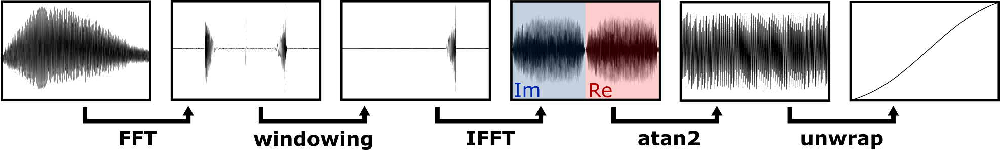

 #  Phase Extraction Extension

Phase Extraction Extension is a plugin for [OCTproZ](https://github.com/spectralcode/OCTproZ). It can be used to determine a suitable resampling curve for k-linearization. 

  

How it works
----------

  

The phase of a calibration signal is extracted, which is used to generate a resampling curve for k-linearization.

A calibration signal can be easily generated by placing a glass window close to the OCT reference arm mirror.

A detailed explanation can be found in the [publication](https://www.osapublishing.org/abstract.cfm?uri=ECBO-2021-EW4A.5). 

How to use
----------
Watch [this video!](https://www.youtube.com/watch?v=nlBWCv9TDJ8)

Download and installation
----------
Download the zip archive from the [GitHub release section](https://github.com/spectralcode/PhaseExtractionExtension/releases) and extract it into the OCTproZ folder (_phaseextractionextension.dll_ should be placed in the _plugins_ folder and _libfftw3-3.dll_ should be in the same folder as _octproz.exe_).

How to compile
----------
Watch [this video](https://www.youtube.com/watch?v=DHB3NX_P1vk) from minute 12:50.

Dependencies
----------
- [FFTW](http://www.fftw.org/)
- [Eigen](http://eigen.tuxfamily.org/)
- [QCustomPlot](https://www.qcustomplot.com/)

Publication
----------
M. Zabic, S. Hansert, S. Johannsmeier, D. Heinemann, A. Heisterkamp, and T. Ripken, "OCT wavenumber calibration with simple reference arm modification," in European Conferences on Biomedical Optics 2021 (ECBO), OSA Technical Digest (Optical Society of America, 2021), paper EW4A.5. 

License
----------
Phase Extraction Extension is licensed under GPLv3. See [LICENSE](LICENSE).
