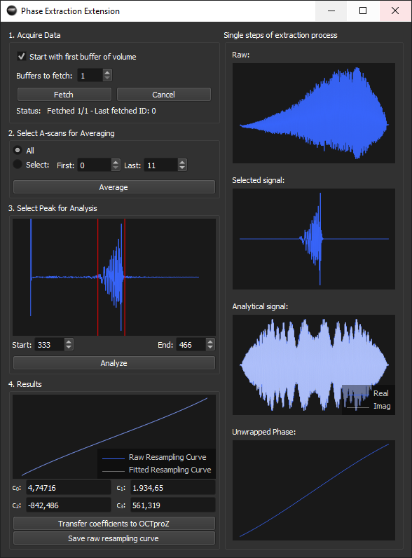
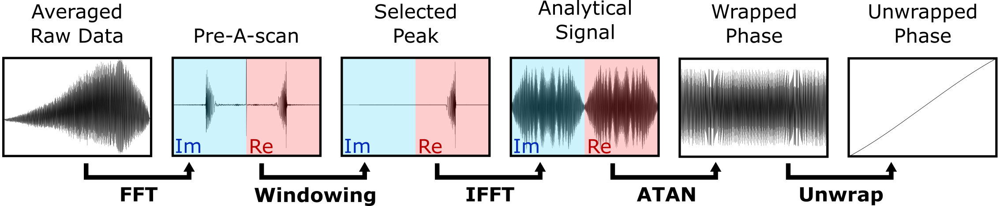

 #  Phase Extraction Extension

Phase Extraction Extension is a plug-in for [OCTproZ](https://github.com/spectralcode/OCTproZ). It can be used to determine a suitable resampling curve for k-linearization. 

  

Phase Extraction Process
--------

  

Dependencies
----------
- [FFTW](http://www.fftw.org/)
- [Eigen](http://eigen.tuxfamily.org/)

License
----------
Phase Extraction Extension is licensed under GPLv3. See [LICENSE](LICENSE).
